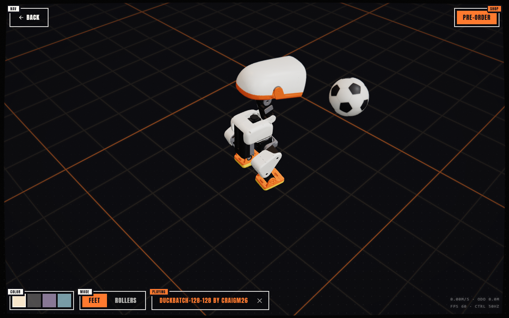

# duckbatch

Batched, judged, efficiency-first training for Pollen Robotics'
[Microduck](https://github.com/pollen-robotics/microduck). Many small attempts share one
simulator batch on one 4 GB laptop GPU. A pre-registered kill order prunes them. Decision models
(Jev, [GLiNER2.5-Decide](https://huggingface.co/fastino/GLiNER2.5-Decide)) are measured as the
judge, not trusted as one.

**Simulation only.** Nothing in this repo has run on a real Microduck.

## Results so far (b002, 2026-09-24)

A **26,254-parameter** student (61-128-128-14, **7.5x smaller** than Pollen's 197,774-parameter
default walker, **2.7x faster** per step) tracks velocity within 5% (planar) and 11% (yaw) of
the teacher, and gets up from a prone fall just as often. It **falls about 3x as often** under
pushes: once every ~2.2 minutes of walking, against once every ~7.

| Held-out seeds 2001-2003 | Pollen teacher | 256-128-64 | 128-128 |
|---|---|---|---|
| Parameters | 197,774 | 57,934 | 26,254 |
| Planar / yaw error (x teacher) | 1.00 / 1.00 | 1.02 / 1.06 | 1.05 / 1.11 |
| Falls per min, walking | 0.14 | 0.38 | 0.46 |
| Gets up from prone within 6 s | 96.9% | 98.2% | 97.1% |
| p50 latency, 1 thread (x86 laptop) | 29.0 µs | 14.5 µs | 10.8 µs |

**Drive them all at once:** the [walker arena](https://huggingface.co/spaces/craigm26/microduck-arena)
puts the teacher, both students and Pollen's earlier walker on one field under one set of
controls (keyboard, gamepad or touch), each in its own identical physics world. Push them all
and watch which one goes down. Source in `arena/`, built with `scripts/build_arena.sh` from
duckbench's runtime.

**Drive them in Pollen's simulator:**
[128-128](https://pollen-robotics-microduck-simulator.hf.space/?move=craigm26/microduck-duckbatch-b002-128x128) ·
[256-128-64](https://pollen-robotics-microduck-simulator.hf.space/?move=craigm26/microduck-duckbatch-b002-256x128x64) ·
results page: [spaces/craigm26/duckbatch](https://huggingface.co/spaces/craigm26/duckbatch) ·
records: [datasets/craigm26/duckbatch-records](https://huggingface.co/datasets/craigm26/duckbatch-records)



**Decision models as judges.** Both saw every case in shadow, on identical text, and were
graded on the cases the pre-registered rules settle. GLiNER2.5-Decide answered "kill, gap 2" at
0.92 to 0.94 on all 17 cases; it would have confidently killed both finalists. Jev's severity
score tracked quality (gap 2.75, falling to 0.26 on the best finalist), and it never made a
confident wrong call. The rules did the deciding. Details:
[`notes/2026-09-24-b002-close.md`](notes/2026-09-24-b002-close.md). The first batch, b001 (every
attempt killed at rung 0, by my own over-strict early gates), is in
[`notes/2026-09-24-b001-close.md`](notes/2026-09-24-b001-close.md).

## The idea

**One env batch, many attempts.** On a 4 GB GPU the simulator is the expensive, shared thing.
The VelStand task fits 512 envs (1024 runs out of memory), which is far more than one small
student needs. So the batch is split into K partitions, one per attempt ("arm"), and every step
advances all K at once: one physics step, one teacher forward pass over the whole batch, and K
tiny student passes. A batch of attempts costs about what one attempt costs. Pollen's teacher
runs as an extra arm, so every evaluation carries its own reference row.

**Successive halving, judged.** After each rung (b002: 150, then 300, then 600 iterations) every arm is
evaluated next to the teacher. The judge is a cascade:

| Tier | Decides | Source |
|---|---|---|
| Rules | clear keeps and clear kills | `batch/judge.py` `DEFAULT_GATES`, committed before the batch ran |
| Decision model | cases between the keep line and the kill line | Jev (acts alone at ≥ 0.90 confidence) |
| Person | whatever the model is not sure about | `pending`; never killed without a decision |

Closed arms hand their envs to the survivors. The `efficiency` rank advances the *smallest* arm
that passes every keep line, because the question is how small the walker can get.

**Where the decision model sits.** It never touches the control loop and never proposes a
config. It answers one bounded question about a case the thresholds cannot call: "extend or
kill?", plus a 0–3 gap score and a yes/no on whether the arm is still learning. Every case is
rendered to one text (`judge.render_case`): the observed numbers, the ratios to the teacher,
and the lab conventions, but *never* which rule line was crossed. Every model answers every
case in shadow. The cases the rules settle are free labels, so each model's agreement with
the rules is a measurement rather than a belief. Stored case texts let any model be replayed
over the identical cases later (`duckbatch rejudge`).

**Distillation by DAgger.** Each arm drives its own envs, with a teacher-override probability
that decays to 0, and the teacher labels every state the arm visits. So a student learns on the
states its own mistakes lead to. Students are trained on the task's full mix, including the
prone spawns and topple pushes VelStand uses to teach getting up, so they learn recovery too.

## What is measured

- **Walking** (`EVAL_PROFILES["walk"]`): HOME spawns with the ordinary ±0.3 m/s stumble
  pushes, domain randomization and observation noise on, and the task's deliberate prone spawns
  and topples off. Metrics: falls per minute (upright to tilted past 60°), time down, and
  planar and yaw velocity-tracking error while upright.
- **Getting up** (`"recover"`): every episode spawns prone. Metrics: the share of spawns upright
  for 0.5 s within 6 s, and the time it takes.
- **On-device cost** (`duckbatch bench`): parameters, FLOPs, bytes, and onnxruntime latency at
  batch 1 on **one thread**, which is how the robot's `duck-control` runs a policy. Also an int8
  dynamic-quantized copy and its action drift on recorded observations. The host is an x86
  laptop, not the robot's RK3566, so read the ratios.
- **Noise floor:** the final numbers are 3 held-out seeds with the teacher in the same run. The
  teacher's spread across seeds is the band a student has to land in. The same seed run twice
  differs by about 3 to 4%, because MuJoCo-Warp is not bitwise deterministic.

## Run it

Linux or WSL2 with a CUDA GPU (4 GB is enough), plus [uv](https://docs.astral.sh/uv/).

```bash
git clone https://github.com/craigm26/duckbatch && cd duckbatch
uv sync --extra sim --extra decide --extra dev
./scripts/fetch_teachers.sh                        # Pollen's policies, pinned revision + sha256
uv run duckbatch probe --envs 256,512,1024         # what fits on your GPU
uv run duckbatch batch menus/b002-student-size-longer.yaml       # ~70 min, RTX 3050 4 GB
uv run duckbatch rejudge records/b002-student-size-longer        # decision-model agreement
uv run duckbatch bench records/b002-student-size-longer/policies/*/policy.onnx \
    teachers/velstand.onnx --int8 --obs records/b002-student-size-longer/obs_sample.npy
```

No GPU? Re-run a menu on Hugging Face Jobs (billed to your account). It clones this repo at your
pushed commit and uploads the records to your dataset:

```bash
uv run duckbatch hf-job menus/b002-student-size-longer.yaml --dataset <you>/duckbatch-records
```

The core install (`uv sync`, with no extras) runs `bench`, `rejudge` with stored answers, and
`publish` anywhere, including native Windows. Only `batch` and `probe` need the simulator.

Optional: a `.env` holding `TYPESAFE_API_KEY` adds Jev as a live judge tier (see `.env.example`).
Without it the cascade is rule → person, and Decide still answers every case in shadow.

Publish a batch (each finalist becomes a Hub repo in Pollen's policy format, playable in their
simulator with `?move=<repo>`):

```bash
uv run duckbatch publish records/b002-student-size-longer --namespace <you> \
    --dataset <you>/duckbatch-records --space <you>/duckbatch
```

## Layout

| Path | What |
|---|---|
| `src/duckbatch/sim.py` | population DAgger, eval profiles, recovery eval |
| `src/duckbatch/batch/` | menu runner (successive halving), judge cascade, Jev and Decide clients, rejudge |
| `src/duckbatch/policy.py` | Pollen-shaped ONNX ⇄ torch; students export as the same `Sub, Div, Gemm…` graph |
| `src/duckbatch/bench.py` | on-device cost |
| `src/duckbatch/publish.py` | Hub policy repos (manifest schema 2), records dataset, Space |
| `menus/` | one YAML per batch: arms, rungs, gates, judge; committed before it runs |
| `notes/` | `…-design.md` before a batch, `…-close.md` after |
| `records/<batch>/` | the menu as run, `rung-N.json`, `record.json`, `judges.json`, `bench.json`, policies |
| `space/` | the static results page |

## Built on

- [pollen-robotics/microduck_rl](https://github.com/pollen-robotics/microduck_rl) at `cb70b79`:
  tasks, robot, and the BAM actuator model (pinned to the commit its lockfile uses). Apache-2.0.
- [pollen-robotics/microduck-policies](https://huggingface.co/pollen-robotics/microduck-policies)
  at `1b56c39`: the teacher, `velstand.onnx`. Apache-2.0.
- [mjlab](https://github.com/mujocolab/mjlab) 1.3.0 on MuJoCo-Warp.
- [fastino/GLiNER2.5-Decide](https://huggingface.co/fastino/GLiNER2.5-Decide) at `65624f1`, and
  TypeSafe's Jev: decision models under test.
- The judge cascade, the pre-registration habit and the Jev client come from
  bounded-answer-lab and rtlab.

## Honest limits

- **Sim only.** A student that matches the teacher in mjlab is a candidate for a hardware test.
- **Distillation is imitation, not RL.** The RL is Pollen's, inside the teacher. These batches
  measure how much of it survives compression. PPO fine-tuning of a student is future work.
- **Latency comes from an x86 laptop,** not the RK3566.
- **duck-studio / duckkit (iOS) only load the stock 61-512-256-128-14 shape today,** so smaller
  students load in Pollen's simulator, the desktop duckbench and on the robot, but not yet in
  the iPhone app.

Apache-2.0.
